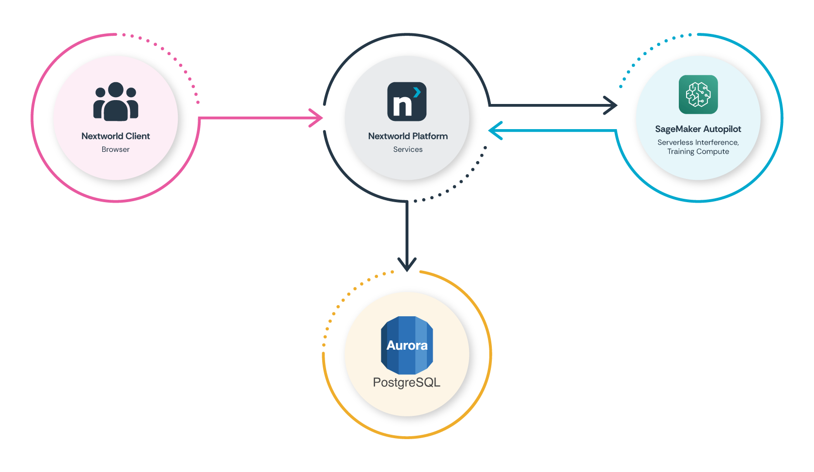

For years, we've offered machine learning capabilities on the Nextworld platform. Our traditional ML facility leverages our no-code interface to let users select algorithms, tune a subset of hyperparameters, train models, and deploy them into production workflows. It works, but it has a fundamental problem: it still requires someone who understands data science.

The point-and-click interface makes the mechanics easier, but the *decisions* — which algorithm to choose, how to engineer features, what hyperparameters to tune — still require expertise that most of our customers don't have on staff. Our data scientists would embed with customer teams for weeks, iterating through the train-test-tune cycle until they hit acceptable accuracy thresholds. They would function as a professional services team rather than working to build features into the Platform itself.

This didn't scale, and it didn't align with our Platform's core promise: enabling citizen developers to quickly build enterprise-grade applications without being software engineers.

We needed to automate the data science itself.

## The Build vs. Buy Decision

When we started exploring AutoML, we did what most engineering teams do: we ran parallel tracks.

Track one was building it ourselves. Our data scientists sketched out an approach for automated feature engineering, algorithm selection, and hyperparameter optimization. They made solid progress. We had a working prototype that could iterate through a handful of algorithms and return ranked candidates.

Track two was evaluating existing solutions. We had non-negotiables that narrowed the field quickly:

1. **API-first access.** Nextworld is a multi-tenant platform. We couldn't have humans provisioning infrastructure for each customer or training job. Everything had to be drivable through code, triggered by user actions in our application layer.
2. **Serverless compute.** Margins matter, especially for smaller customers. Traditional ML infrastructure — keeping GPU instances warm, managing capacity — creates a cost floor that makes ML financially unviable for many use cases. We needed on-demand compute that scaled to zero.
3. **No operational overhead.** We're a managed platform. Our customers don't manage infrastructure, and we didn't want to manage ML infrastructure either. Whatever we chose had to handle the undifferentiated heavy lifting.

SageMaker Autopilot checked every box, and then gave us things we hadn't prioritized but immediately valued. Pre-generated visualizations for confusion matrices and feature importance that we could surface directly in our UI without additional processing were a fan-favorite of our data scientists.

The build track got shelved. Not because our team couldn't do it, but because the opportunity cost didn't make sense. Those data scientists could build novel Platform features instead of rebuilding capabilities AWS had already productionized.

## Architecture

The integration between Nextworld and AWS SageMaker Autopilot is straightforward, which is part of why it works so well.

When a user initiates an AutoML job, they're pointing at data that already exists in their Nextworld environment — either native records, or data brought in through our integration layer. They select which field they want to predict (the target variable), and they click a button.

Behind the scenes, our Platform's AutoML services automatically:

1. Extract and format the training dataset.
2. Submit a training job to SageMaker Autopilot's compute endpoints.
3. Wait for an AWS Lambda to call back into the Platform, indicating that training is complete and providing us with candidate models.
4. Pull model artifacts and analytics from S3.
5. Register the models in our Platform's ML model registry.

For real-time inference during business processes and logic, we hit serverless endpoints. They scale to zero when idle and wake on demand. This is critical for cost management — many of our customers' ML use cases are batch processes or low-frequency predictions where keeping infrastructure warm would be prohibitively expensive — especially in the early days of AutoML's life, where adoption-based economies of scale were not yet at play.

Multi-tenancy is handled at our Platform's data access layer. Each customer's data stays isolated, and their models are scoped to their tenant. SageMaker doesn't need to know about our tenant model; it just processes the jobs we submit.

## Making Data Science Decisions Accessible

Automating the technical process was only half the problem. We still needed to help business users make informed decisions about which model to deploy.

Autopilot returns multiple candidate models, each optimized differently. One might minimize false positives. Another might minimize false negatives. A third might balance precision and recall. For a data scientist, this is familiar territory — you look at the confusion matrix, consider your use case, and pick accordingly.

For a product owner who's never seen a confusion matrix? This is where things break down.

We added a layer that uses an LLM to generate plain-language descriptions of each candidate. Instead of showing raw metrics, we explain what each optimization *means* for the user's use case.

Think about COVID tests as an analogy. When health officials talked about test efficacy, they didn't show confusion matrices. They said "this test has a 2% false positive rate and a 5% false negative rate." Everyone understood the tradeoff: a test optimized to catch every positive case would also flag some healthy people. A test optimized to never incorrectly flag healthy people might miss some infections.

We do the same thing. For a fraud detection model, we might explain: "This model catches 98% of fraudulent transactions but will flag approximately 3% of legitimate transactions for review." vs. "This model rarely flags legitimate transactions but will miss approximately 15% of fraudulent ones."

Users pick based on their business context, not based on interpreting statistical metrics.

## Results

The outcomes surprised us, even though they make sense in retrospect.

First, we saw a **95% reduction in build time.** What previously took 4+ weeks — from initial data exploration to production deployment — now takes about 2 days. Most of that time is the training job running, users reviewing candidates, and consuming them in known business processes. The human labor component of building and deploying accurate models essentially disappeared.

Second, we realized a **33% average accuracy improvement.** This was counterintuitive at first. How does automation beat expert data scientists?

The answer is iteration speed. AutoML can explore more algorithms, more hyperparameter combinations, more feature engineering approaches in minutes than a human team can explore in weeks. It doesn't get tired. It doesn't have intuitions that bias it toward certain approaches. It just systematically works through the search space and finds what performs best for the specific dataset and prediction task.

Human intuition is valuable, but it's also limiting. Our data scientists would make reasonable assumptions about which algorithms would perform well based on the problem type, and they'd be right often enough. But "often enough" isn't "optimal." AutoML finds the edge cases where gradient boosting beats random forest by 4%, or where an unusual feature engineering approach unlocks hidden signal in the data.

## The Broader Lesson

There's a tendency right now to dismiss "traditional" ML as outdated, overshadowed by LLMs and generative AI. That's a mistake.

LLMs are powerful, but they're probabilistic in ways that many business processes can't tolerate. When you need deterministic predictions — will this transaction be fraudulent, will this organ be viable, will this machine fail in the next 30 days — you need models trained on your specific data to make your specific predictions.

What AutoML does is make that capability accessible to the people who understand the business problems best. Domain experts can now build and deploy production ML without waiting for data science resources. They iterate faster because they understand the problem space. They catch data quality issues because they know what the data should look like.

Data scientists and engineers haven't become less valuable — they've become more valuable. Instead of doing repetitive model-building work, they can focus on building capabilities, edge cases that AutoML doesn't handle well, and genuinely novel ML applications.

The most impactful AI strategy isn't always the most sophisticated one. Sometimes it's making proven technology accessible to the people who need it.

*See also: [a talk that we gave on this at AWS re:Invent 2025](https://www.youtube.com/watch?v=BlBWQHAF_Ss).*
