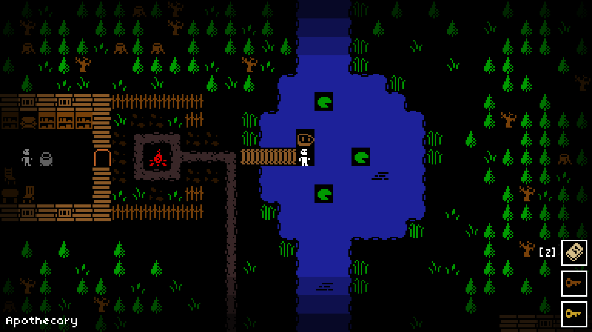
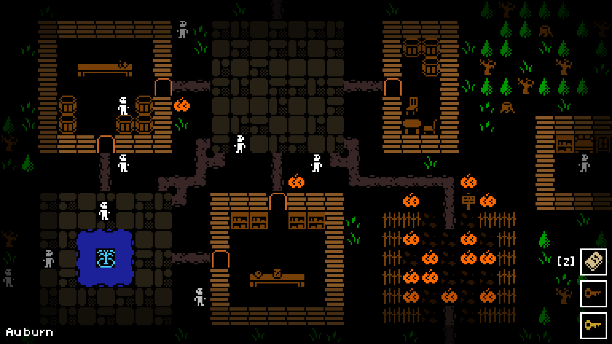

A mystery adventure game about Halloween with roguelike elements built using [Godot Engine](https://godotengine.org/).

> What starts out as a regular Halloween evening for Oliver quickly turns into a confusing, disturbing mystery that must be solved. Explore the town of Auburn in search of answers. Will you be able to figure out what is going on?

Inspired by underground classics of the past - like Twisterghost's LOLOMGWTFBBQ series - Cryptic is a short, eerie roguelite where you must help out friends, explore interesting areas, and ultimately figure out what happened.

[Play now on itch.io](https://lukehollenback.itch.io/cryptic) · [Source on GitHub](https://github.com/lukehollenback/cryptic)
