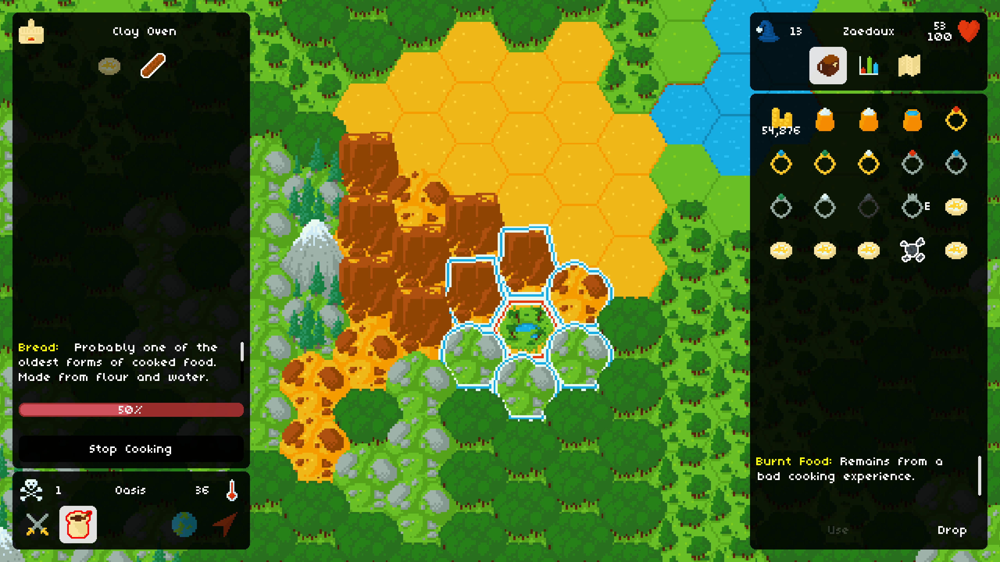
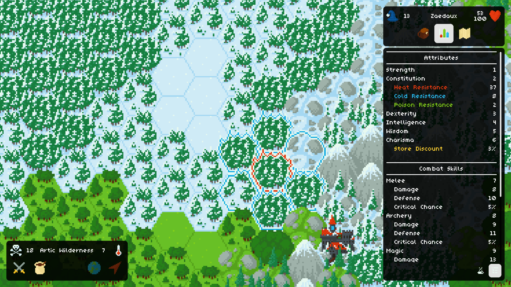

A procedurally-generated role-playing adventure built using [Godot Engine](https://godotengine.org/). Makes use of procedural-generation techniques like [OpenSimplex noise maps](https://en.wikipedia.org/wiki/OpenSimplex_noise) and pluggable generation rulesets to create a unique, immersive experience every playthrough.

> In Firetale, no two adventures are the same. Discover your own tale in a vast, procedurally-generated open world. Unique quests, characters, enemies, and items are at every corner in this strategy role-playing game.

[View progress and devlogs on itch.io](https://lukehollenback.itch.io/firetale)
